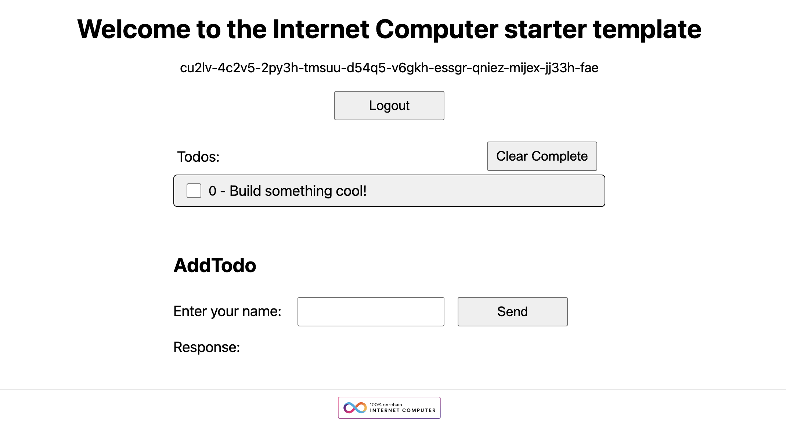

# InternetComputer - Motoko + Next.js Template

This is a template for creating a Next.js app with a Motoko backend that can be deployed to the Internet Computer.

## Getting Started

1. Install the [DFINITY Canister SDK](https://sdk.dfinity.org/docs/quickstart/local-quickstart.html)
2. Install [Node.js](https://nodejs.org/en/download/)

## Running Locally

Installing dependencies:

1. Run `yarn install:all` or `npm run install:all`
   it will run the following commands:

   Install Node.js dependencies:

- Run `yarn install` or `npm install`

Running Local Internet Computer:

2. Run `yarn dfx:start` or `npm run dfx:start`

Deploying to the Local Internet Computer:

3.1 Run `yarn dfx:pull` or `npm run dfx:pull`
3.2 Run `yarn dfx:identity` or `npm run dfx:identity`
3.3 Run `yarn deploy` or `npm run deploy`

Running Next.js app:

4. Run `yarn dev` or `npm run dev`
5. Open http://localhost:3000 in your browser

## Deploying to the Internet Computer

1. Run `yarn deploy --network=ic` to deploy the canisters to the Internet Computer

## Notes

- The Motoko code is located in the `backend` directory
- The Next.js code is located in the `src` directory
- The canister configuration is located in the `dfx.json` file

## Resources

- [DFINITY Canister SDK](https://sdk.dfinity.org/docs/quickstart/local-quickstart.html)
- [Motoko](https://internetcomputer.org/docs/current/motoko/main/motoko)
- [Next.js](https://nextjs.org/)
- [ic-reactor](https://github.com/B3Pay/ic-reactor)
